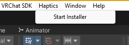
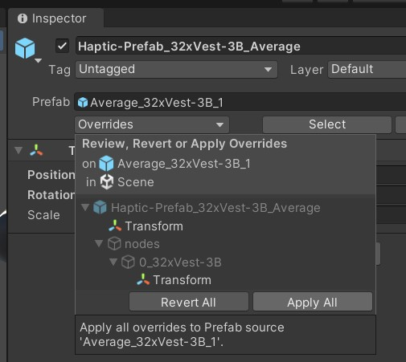

# Avatars

## About

***NOTE**: This project is new and still under LOTS of work. Please be patient and feel free to reach out with questions*

Haptic information is primarily gathered from [VRC Contact Recievers](https://creators.vrchat.com/avatars/avatar-dynamics/contacts/#vrccontactreceiver) on avatars. This means that you need to be able to customize your avatar to integrate haptics onto it. Due to some technical stuff, **YOU CANNOT SELF-INTERACT**, this means your own hands won't trigger haptics. This is expected behaviour

The installer creates avatar generic prefabs, this means exporting the `Assets/Haptics` folder allows for all avatars using that base to simply import and drag the `Assets/Haptics/Haptics-Integration` prefab onto the avatar root. On upload, the haptics get placed onto the avatar itself, without only one synced bit and a few triangles.

## Performance

Currently only a subsection of people care about game performance. But to those that do care:

#### Per Bone Performance
Due to the optimization process, some details scale with the number of bones the optimized prefab is attached to. For example a Vest + Headset + Ear Pull combination results in a multiplier of 4x. 

*Vest:(hip, spine, chest) + Headset:(head) + Ear Pull(head)-> Optimized:(hip, spine, chest, head)*

**Effected:**
 - Mesh Renderers
 - Material Slots 

#### All Local Contacts: 
 - Haptic Node's don't count towards contact limit.
 - What *you* see is what gets turned into feedback, regardless of your in-game ping.
 - Minimal performance cost.

#### 20 Triangles per Node
 - Low-Poly "grapes" model allows for reasonable triangle numbers
 - A default 32 node vest adds 640 Triangles (20x32=640), 
 - Please keep in mind triangle count scales VERY aggressively, A small increase in model triangles gets multilplied by 60+ in some cases.

#### One Synced Bit: Uses 1 out of the 256 bits allocated for your avatar.
 - Currently only one synced bit is used; to toggle on and off the visualizers.

## Haptics Installer

Haptic information is primarily gathered from [VRC Contact Recievers](https://creators.vrchat.com/avatars/avatar-dynamics/contacts/#vrccontactreceiver) on avatars. This means that you need to be able to customize your avatar to integrate haptics onto it.

The installer can be found under the Haptics menu on the top bar:

[Haptics-Installer](https://github.com/VRC-Haptics/Unity-Haptics-Installer) handles most of the background work and can be installed using the VRChat Creator Companion, or ALCOM. Simply [add the VCC Listing](https://vrc-haptics.github.io/Unity-Haptics-Installer/) and import it into your project to get started.

This will also install the required depenencies; mainly VRCFury. We are currently using VRCFury to create avatar-agnostic prefabs, until we devise our own solution for resolving avatar bones to unity's `HumanBodyBones` this will be a requirement. (already experimental solutions in place)

## Basic Integration

#### ***IMPORTANT***: DO **NOT** "Auto Fix" until told to, this will destroy the method of optimizing and modifying your haptic Prefabs, and you will likely have to restart the process.

#### Steps

Here I put a basic vest prefab onto the generic robot avatar. For Demonstration purposes.

1. Setup a VCC avatar project with the [Haptics Installer](#haptics-installer) and dependencies installed.

1. Download a configuration file like this one: [32 Node Vest](https://github.com/VRC-Haptics/haptic-config-hosting/blob/main/configs/Average/Average_32xVest-3B_1.json)
    
    *Any configuration files in the linked repository are automatically availbable to the Haptics Manager. Custom configuration files will have to be added locally.* (will change soon)

1. Create Basic Prefab
    - Drag your avatar root into the `Avatar Root` field. (tries to auto-populate)
    - Select Your Configuration File from step 1.
    - Ensure it loaded correctly:
        
    - Click the Create Prefab button.

1. You should now have something like this: - 
    

1. Fit To Avatar
    - Make sure your main body mesh is in the `Body Mesh` field. 
        - The Fitting tool will use this mesh as a collider to shrink the nodes to. Typically this means they should stick to the "skin" of an avatar and not clothes where possible.
    - Drag your prefab you want to fit into the `Prefab to Edit` field.
    - Click the `Fit To Avatar` button.
        - This tries it's best to fit the nodes to your avatar. The closer to humanoid proportions the avatar is generally the better it will work.
    
        
    - Fine Tune Fit.

        Here the goal is to get the **CENTER** of the node to touch the skin of the avatar.

        Use `Next` and `Previous` buttons to step through each node

        - Use Unity's `Move Tool` to fine tune the position, usually the yellow square (x y plane) is the best way to do this.
        - **Flagged Entries**: Are nodes that weren't able to be automatically fitted, and are highlighted in red. Use the `Flag` button to undo this marker once manually corrected, or mark a seperate node.
        - Use the `Node Scale` slider to adjust your nodes size. Bigger nodes offer more granularity, while more often getting false triggers from further contacts. Good scales are typically between 0.5 and 1.5, though this depends on the intial configuration file.

1. **SAVE YOUR CHANGES**

    To save your fitting changes, select your prefab root, and go the: `Inspector -> Overrides -> Apply All` button.
    

1. Repeat steps 2-6 for each desired prefab.

1. Optimize For Final Product
    - Add each of your prefabs to the `Prefabs to Optimize` Field
    - Click `Bake Prefabs` option. 
    - Remove all haptic related prefabs from the avatar other than the `Haptics-Integration` (they are saved in the `Asssets/Haptics` directory if you ever need them again.)

1. Upload
    - Click the "Auto Fix" button if you like.
    - Complete Normal upload process.
    