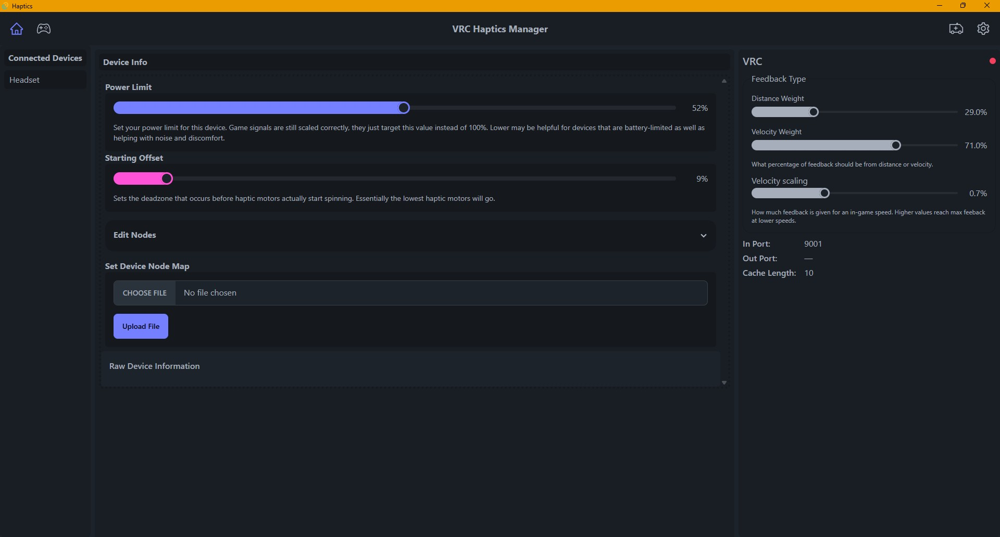

# Manager App

This is the main application for the whole haptics project. It is a required component to funnel the data from VRChat into our haptic devices. Along the way it provides an interpretation layer that allows for generic inputs from an avatar to be translated to accurate feedback on almost any feedback placement.

Download from here: [https://github.com/VRC-Haptics/VRCH-Server/latest](https://github.com/VRC-Haptics/VRCH-Server/releases/latest)

**PSA**: The frontend needs some major reworks. The scaling, scrolling, and general layout are known issues and help would be **GREATLY** appreciated in the UI area in general.

Eventually this manager will be Android, Linux, etc, compatible but getting it working on windows is the main priority at the moment. 

## Connected Devices

This column lists the devices connected through various means and brings up their individual [Device Info](#device-info) panel when clicked. Will show how a device is connected, like wifi or Bluetooth when those are supported officially.

## Device Info

Shows the device specific settings and configurations. Generally the only changes an end user should make is to fine tune the `Power Limit`. Likely this should be split off into a seperate "Device Editing" tab, that warns of making breaking changes, in the near future.

## VRC
This shows the state of our VRC connection. Mainly exposing the Feedback Type and Velocity Scaling sliders. These are used to determine how much feedback is from speed and how much is from how close a contact is to our reciever. 

Examples: 
 - (Distance @ 0%, Velocity @100%) Still Hand: No haptic feedback.
 - (Distance @ 100%, Velocity @0%) Still Hand: 100% Feedback.
 - (Distance @ 50%, Velocity @50%) Still Hand: 50% Feedback.

**Velocity Scaling**: It's a magic number that tells how fast is fast. Bigger numbers mean more feedback. 

### Nerd Stuff
Technically speaking velocity more closely represents vibration in mathematics and personally it seems a more accurate sensation. BUT your brain can lose out on some information on purely velocity based feedback. So this blending method helps in a few ways.

Blending the two signals not only solves the accuracy issue but also creates a feedback pattern where it naturally draws attention to movement, while stationary signals lower feedback but keep information about postioning. Merging the signals also improves latency when finding averages.

Currently latency is mainly limited by VRChat's 10hz max parameter update rate. This incurs a +100ms latency from out of the gate. When making velocity calculations atleast 2 samples are needed, often around the area of 3+ to help deal with frametime spikes. That's almost 1/3rd of a second that is completely out of our control when it comes to velocity calculations. Positional data meanwhile is only as old as the latest sample, so &lt;100ms typically.

On top of everything else it even helps with battery effeciency, as well as removing the numbing effect from continous vibration.
